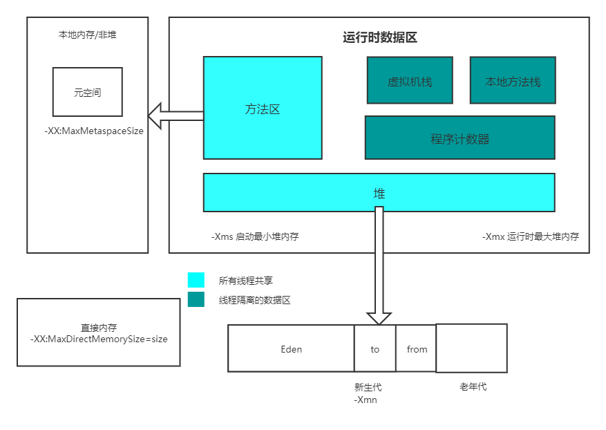

##### 作业2 自定义一个 Classloader，加载一个 Hello.xlass 文件，执行 hello 方法

具体代码见homework01模块内

##### 作业3 展示 Xmx、Xms、Xmn、Meta、DirectMemory、Xss 这些内存参数的关系

1. Xmx：指定最大堆内存
1. Xms：指定堆内存空间的初始大小
1. Xmn：等价于 `-XX:NewSize` 即指定新生代大小，官方建议Xmx的1/2~1/4
1. Meta (-XX:MaxMetaspaceSize=size)：设置Meta空间大小
1. DirectMemory(-XX:MaxDirectMemorySize=size)：设置系统可使用的最大堆外内存
1. Xss：设置每个线程栈的字节数

